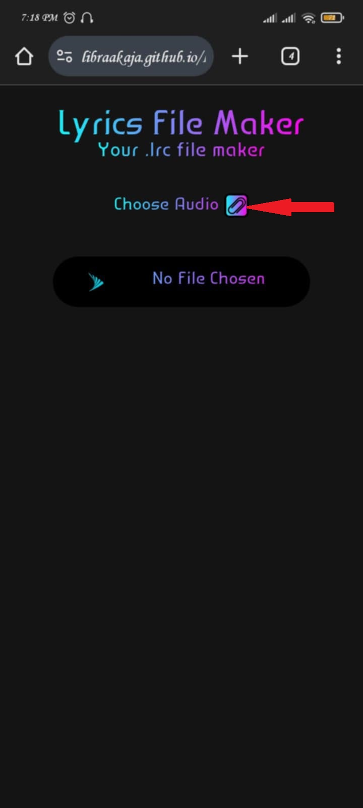
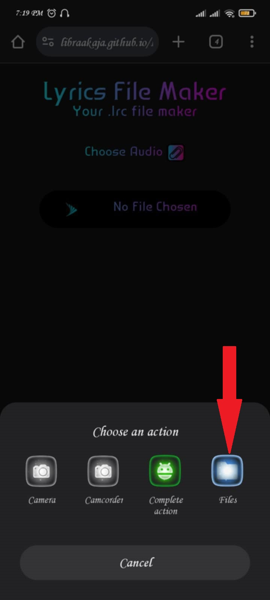
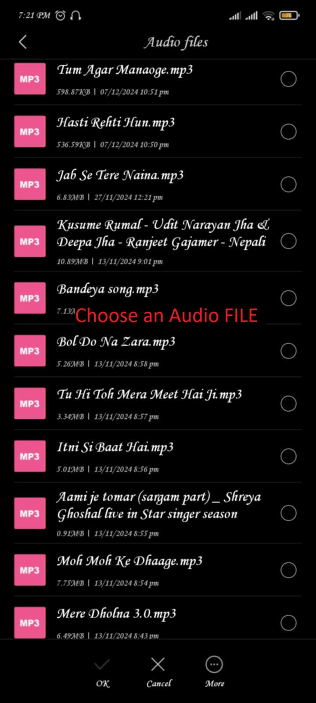
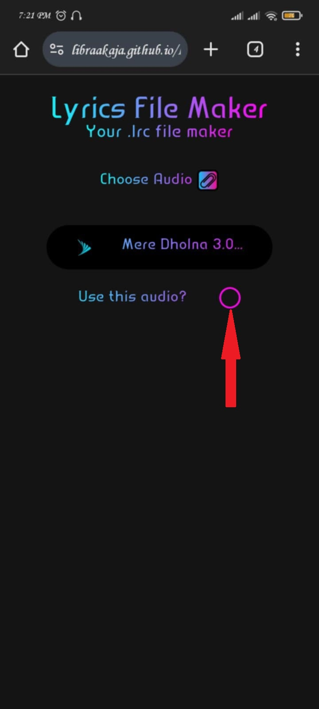
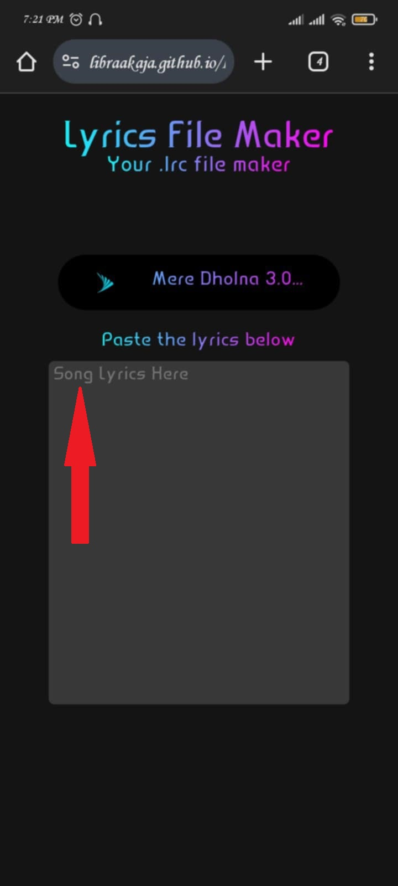
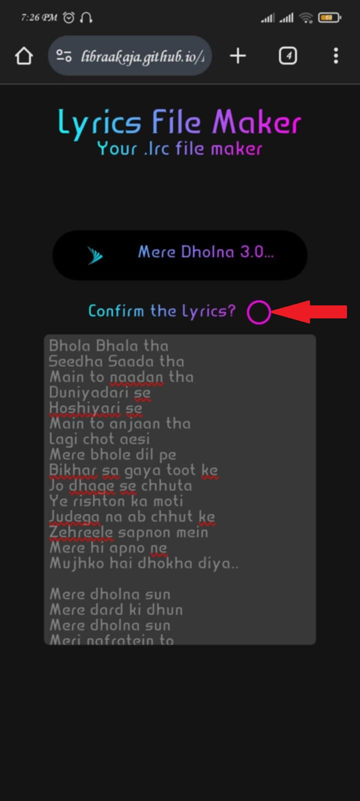
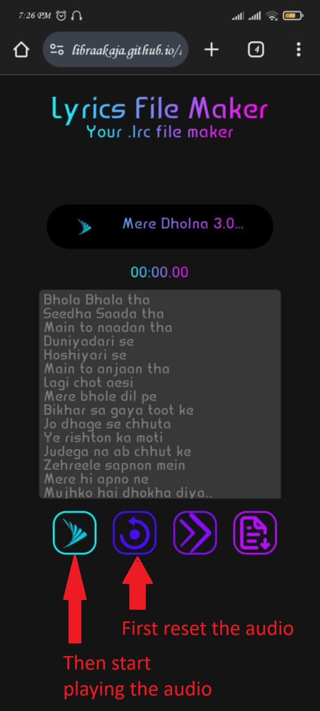
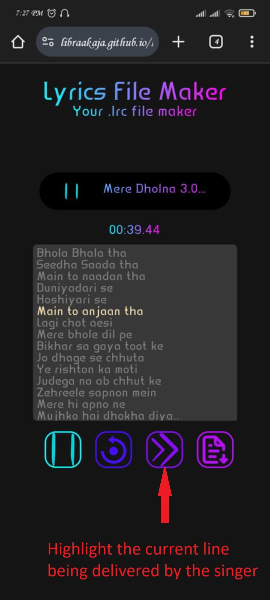
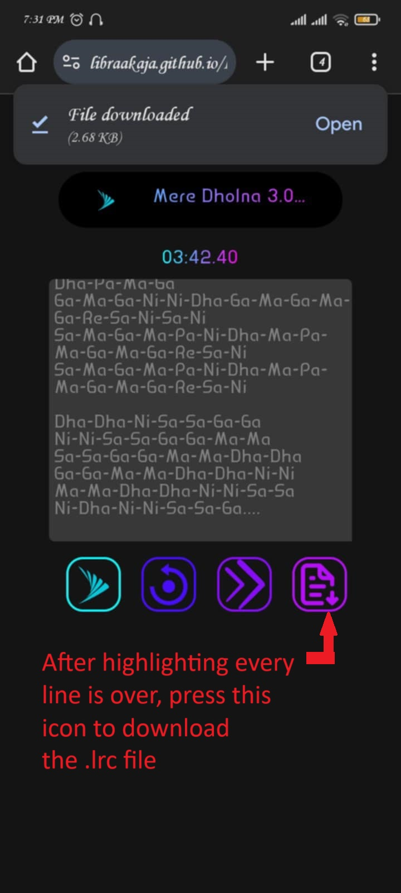
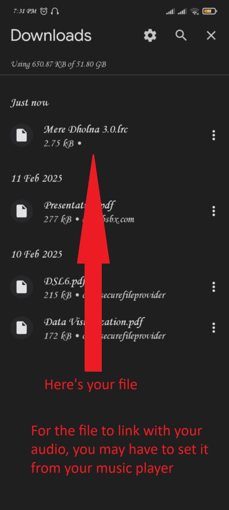

# Lyrics File Maker

A simple **.lrc file maker** built with **HTML, CSS, and JavaScript**.

## 🌟 Features
- **Lyrics File**: Provides users to create their own .lrc lyrics file to be put onto their mobile system's music player songs. 
- **Fully responsive**: Works smoothly across different devices.
- **Simple UI**: Clean and intuitive design for easy use.
- **Useable on GitHub Pages**: No installation needed!

## Technologies Used

- HTML
- CSS
- JavaScript

## How to Use
1. Choose the audio you want by clicking the Attach icon.
2. Confirm the audio by clicking on the checkbox or circle.
3. Paste the lyrics onto the textarea that appears. You may edit lyrics right there if you want.
4. Confirm the lyrics.
5. 4 icons may appear along with the lyrics containing box.
6. The first button is the play/pause button.
7. The second button is the reset button.
8. The third button is the next line highlighter button.
9. The fourth button is the save/download the .lrc file button.
10. Start playing the audio.
11. Just right when a particular line of the lyrics sounds, click on the highlighter button.
12. Once all the lines in the lyrics are done, the file will be created and you are able to download the file by clicking on the save button.

## 🌐 Live Page
[Make Your .lrc File Now](https://LibraAkaja.github.io/Lyrics-File-Maker/) 🎲

## 📦 Installation
If you want to run it locally, follow these steps:

```sh
# Clone the repository
git clone https://github.com/LibraAkaja/Lyrics-File-Maker.git

# Navigate to the project folder
cd Lyrics-File-Maker

# Open index.html in a browser
```

## 🖼 Screenshots
&nbsp;&nbsp;&nbsp;&nbsp;&nbsp;&nbsp;&nbsp;&nbsp;<br><br>
&nbsp;&nbsp;&nbsp;&nbsp;&nbsp;&nbsp;&nbsp;&nbsp;<br><br>
&nbsp;&nbsp;&nbsp;&nbsp;&nbsp;&nbsp;&nbsp;&nbsp;<br><br>


## Acknowledgements
- Icons by [Icon Finder](https://www.iconfinder.com/)
- Webpage Inspiration [LRC generator](https://www.lrcgenerator.com/)

## 🛠 Technologies Used
- 🎨 **HTML & CSS** - For the user interface and styling.
- ⚡ **JavaScript** - For timer logic, file making logic and interactivity.
- 🌐 **GitHub Pages** - For hosting the page online.

## 🤝 Contributing
This project is currently **not open for contributions**. If you have any suggestions or feedback, feel free to open an issue.

## 🚫 License
This project is for personal or educational use only. Redistribution or commercial use is not allowed.

## 📞 Contact
For any inquiries or feedback, feel free to reach out:  
- 📧 **Email:** [adhikaribiraj908@gmail.com](mailto:adhikaribiraj908@gmail.com)  
- 🔗 **GitHub Issues:** [Report a Bug or Suggest a Feature](https://github.com/LibraAkaja/Lyrics-File-Maker/issues)  
